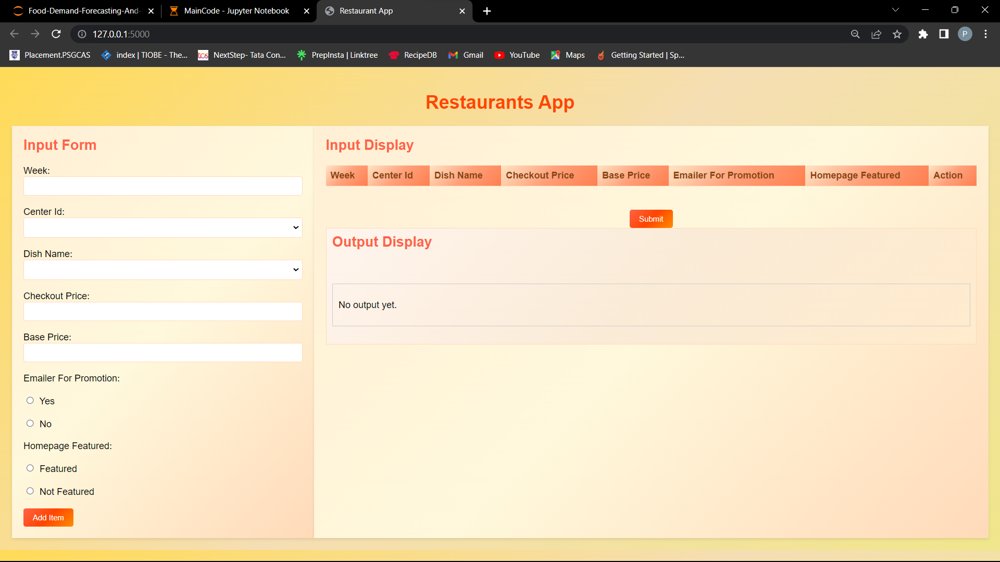
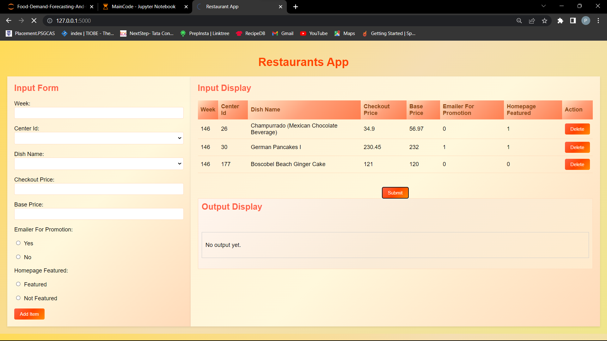
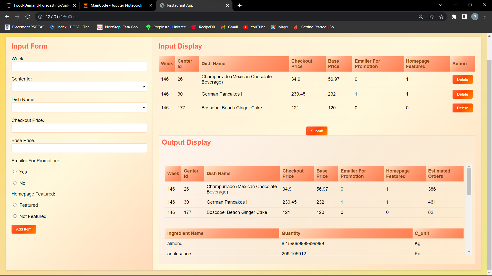

# Food-Demand-Forecasting-and-Raw-Material-Prediction

This project utilizes advanced predictive modeling techniques to forecast food demand and raw material requirements for restaurants. It employs the STL algorithm and regression models to deliver accurate predictions. Additionally, a user-friendly web interface powered by Flask makes it easy to input parameters and obtain forecasts.

## Key Features

- Accurate food demand and raw material forecasting.
- Utilization of STL algorithm for seasonal and trend decomposition.
- Regression models for precise predictions.
- User-friendly web interface created with Flask.

## Output






## How to Use

1. Clone the repository to your local machine:

   ```shell
   git clone https://github.com/Prabakaran-MS/Food-Demand-Forecasting-and-Raw-Material-Prediction.git
